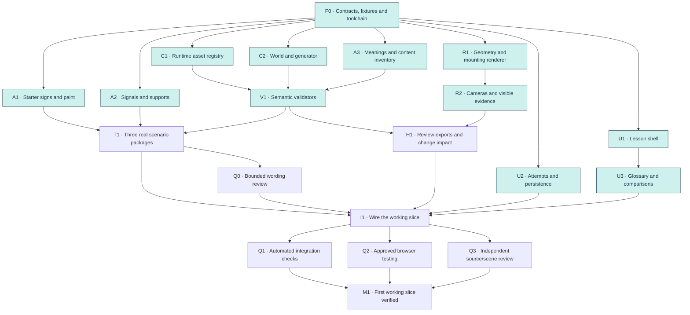
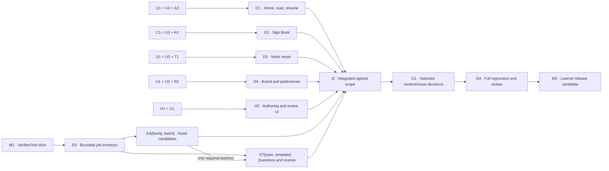

# Ottie execution plan and agent dependencies

Original planning baseline: `d03f0691b2b1f8ac9dd1d89bfdd3977067b1661c`.
Implementation checkpoint: 14 September 2026, based on `main` at
`181cdf9f8173e44a5c7e7366ab8c667ca94f2972` after
[F0 was merged in PR #3](https://github.com/aniruddha-adhikary/drive-with-ottie/pull/3).
The current branch consolidates delivered modules and records the remaining
work. It is not the completed first working slice or a learner release.

## Current implementation checkpoint

**12 of 18 software assignments have delivered code.** F0 is already on `main`;
this checkpoint adds the other eleven assignments. The workflow stopped before
the final six assignments after a usage-limit interruption. The current request
is to preserve the completed work in a PR, so unfinished agents are not being
restarted as part of this checkpoint.

“Delivered” below means the bounded module exists. It does not mean its
cross-module acceptance criteria or independent review have passed.

| ID | Mode | Delivered output | Original worker commit |
|---|---|---|---|
| F0 | Ultra | Versioned contracts, typed fixtures, React/Vite toolchain and fixture inspector; merged in PR #3 | `4aaa943` |
| A1 | Normal | Give Way/STOP artwork and D/J/E/F marking candidates with reproducible checks | `34bac9c` |
| A2 | Ultra | Mounted-sign and vertical-signal candidates with sourced dimensions and explicit unknowns | `4725e0f` |
| A3 | Normal | Starter rules, terms, official source register and syllabus coverage inventory | `7de9f65` |
| C1 | Normal | Runtime registry compiler, provenance checks, dependency closure and release refusal | `befe911` |
| C2 | Ultra | Deterministic immutable-world generator, directed lanes, anchors and signal movement semantics | `0e3ab5d` |
| R1 | Ultra | Physical road, paint, actor, support, sign and signal scene graph | `b179c7c` |
| R2 | Ultra | Four camera families, fitting, visibility diagnostics and linked detail-view data | `d75ea83` |
| U1 | Normal | Four-option lesson components and enlarged viewer shell | `22980ea` |
| U2 | Normal | Attempt/run transitions, queue, progress and device-local persistence | `f624587` |
| U3 | Normal | Glossary/explainer, confusables, focus/scroll restoration and comparison requests | `915dd81` |
| V1 | Ultra | Ten semantic validator families and mutation cases | `40d460f` |

The worker changes were applied in dependency order onto the squash-merged F0
baseline. Their source branches remain available. The frozen public contracts
were not changed during consolidation.

### What is runnable now

`npm run dev` starts the existing development fixture inspector. Its canvas
still uses `buildSchematicScene`; the R1 renderer and R2 evidence-aware cameras
are module implementations awaiting I1 wiring. U1 and U3 components have DOM
tests but are not mounted by the app route registry. U1 still uses a stub scene
and ephemeral React state; U2 persistence is not connected to it.

Starter candidates and meanings exist as source-backed development inputs.
T1 has not authored the final scenario/question packages. Comparison requests
exist, but comparison-world derivation and rendering remain unfinished.

### Checks on the consolidated modules

Run with Node `24.20.0` and npm `11.19.0`:

| Check | Result |
|---|---|
| `npm run lint` | Passed |
| `npm run typecheck` | Passed |
| `npm run test` | **323 passed, 1 failed** across 40 files |
| `npm run build` | Passed; Vite reports a large application chunk |
| `npm run review:export` | Runs; three F0 fixtures report zero semantic errors with explicit quarantine/source warnings |
| `node content/assets/starter-assemblies/check.js` | Passed |
| `python3 content/assets/starter-signs-markings/generate.py check` | Candidate output reproduces byte-for-byte |
| `python3 -m unittest discover -s content/assets/starter-signs-markings -p 'test_*.py' -v` | 10 passed |

The failing test is `tools/scenario-review/src/cli.test.ts:11`: the F0 skeleton
expects at least one semantic validator not to have run. V1 now reports all ten
families. The CLI also prints an empty “validators NOT run” line. H1 must
reconcile the review-output contract and its obsolete skeleton expectation;
this checkpoint does not weaken validation to satisfy that assertion.
Consequently `npm run check` is not green.

These are local module checks, not Q1's final integration verification. No
browser/UI testing or Q3 independent source/scene review has run on this
checkpoint. Original PDF inspection reported by asset workers is retained as
provenance; this consolidation did not repeat their extraction review.

### Open findings and integration handoffs

- **C2/T1:** some Give Way left-turn variations with major-road traffic on the
  non-conflicting side claim a priority relationship that is not present.
  V1 correctly reports `question_evidence.priority_evidence_without_conflict`.
  T1 must exclude those questions until the relationship/evidence is corrected;
  the validator must continue rejecting the invalid claim.
- **R2/I1:** the signal fixture's phone-sized plan view cannot make the
  oncoming actor readable at the current threshold. The diagnostic is
  `camera_evidence.too_small`. Resolve this through an appropriate initial
  view or linked evidence presentation while preserving physical geometry.
- **A2/T1:** signal support dimensions remain schematic; horizontal signal
  artwork and Green B placement are unresolved. F0/C2 model north–south signal
  heads only. Do not describe the fixture as a fully sourced junction or
  include the crossing variant before its separate evidence is resolved.
- **H1:** review output currently summarizes F0 fixtures. Camera contact
  sheets, generated-world exports and end-to-end asset-change impact reports
  are not implemented.
- **I1:** connect real geometry/cameras, content, glossary and U2 persistence.
  Pass C1's source records into the validation context alongside A3's source
  register. Keep source/reuse approval separate from development loading.
- **Q1/Q3:** verify the same integrated commit after I1. Q2 remains a separate
  browser-testing handoff requiring user approval.

### Next execution order

1. Review this intermediate PR and retain its commit as the next baseline.
2. Run **T1 (Normal)** and **H1 (Normal)** concurrently using the delivered
   dependency modules.
3. After T1, run **Q0 (Lite)** for a bounded wording review.
4. Run **I1 (Ultra)** after T1, H1, Q0, U2 and U3 are ready. Reconcile the
   findings above rather than treating collected branches as an integrated app.
5. Run **Q1 (Normal)** and **Q3 (Ultra)** on the exact I1 commit; request Q2
   approval for browser testing. M1 remains pending until all required gates pass.

Do not resume the old workflow unchanged: its recorded I1 instructions predate
this consolidation. A future run must use the accepted checkpoint baseline and
avoid reapplying worker commits already present.

## Recommended execution model

Use a **dependency-driven dynamic workflow with up to five concurrent
software agents on separate VMs**, plus the parent as orchestrator. The first
working slice has **18 software-agent work packages**, one separate UI-testing
handoff, and a milestone gate. These are assignments over time, not 19 agents
started together. Agents consume additional ACUs; concurrency reduces elapsed
time, not total work or cost.

The parent owns scope, contracts, scheduling, integration and escalation.
Workers own bounded modules and return pushed commits with evidence. Keep the
parent available for decisions instead of assigning it a large renderer task.
UI-driven testing uses the persistent testing agent after the user approves
that testing. It owns its browser/server setup and is not a substitute for
shell-based tests.

Start with **Give Way, STOP and a signalised junction**. Include circular
green/red-right-arrow interpretation in that junction. Add a signalised
crossing variant when its paint, heads and placement evidence are resolved;
do not silently treat the three-fixture slice as validating every crossing.

The next milestone is a usable learning app with the agreed BTT content scope.
Do not wait for all 339 references to become production assets before proving
the first three situations.

## What is already available

| Input | Use in implementation | Remaining work |
|---|---|---|
| [339 asset records and extraction tools](../README.md) | Stable IDs, original artwork, measurements, source hashes and coverage | Select and review runtime candidates; preserve unresolved records |
| [Scenario contract](SCENARIO-SYSTEM.md) and [v1 contracts](implementation/CONTRACTS.md) | World coordinates, lane graph, assemblies, cameras and validators | Wire implemented modules together and close recorded findings |
| [Visual system and v3 layout](VISUAL-SYSTEM.md) | Typography, colours, four-option layout and secondary scene controls | Integrate U1/U3 with the real scene and verify them in use |
| [Product design](../DESIGN.md) | Open-ended runs, gentle return, glossary, Sign Book, milestones and mock exam | Connect U2 persistence and implement the remaining product/content tracks |
| [Official source register](research/SINGAPORE-ROAD-CONTROLS.md) | Geometry versus meaning, effective editions and known conflicts | Resolve applicability for the selected teaching scenarios |

All current assets have `release_ready: false`. A development review fixture
can display explicitly labelled reference material; the learner release
bundle must pass the existing approval rules. Work on source review starts
early and does not prevent independent implementation against typed fixtures.

### Established foundation decisions and remaining scope

- F0 established a responsive web prototype using TypeScript, React, Vite and
  one Three.js world. The toolchain is installed through `npm ci`; content
  contracts remain framework-free and portable.
- Prefer device-local progress for the first prototype. Accounts, cloud sync,
  a backend and public deployment are separate scope decisions.
- Author starter questions from reviewed official material. The asset
  extraction is not a licensed question bank, and CDC access is not an input.
- Mock mode's actual question count, duration and pass threshold need an
  authoritative source and a recorded product choice; do not bake an
  unverified exam format into the session engine.
- Ottie character artwork is not established by the road-control library.
  Brand illustrations have a separate owner and cannot change canonical
  signs, signals or paint.

## Dependency diagram: first working slice

An arrow is a prerequisite for completing a task. Once the contracts in F0
exist, implementation can use the supplied fixtures without waiting for the
real neighbouring implementation. I1 verifies the real combinations.



Shaded nodes have delivered modules in this checkpoint; unshaded nodes remain
pending. Delivery does not imply integration or release approval.

Q2 also needs user approval for UI-driven testing. M1 is an integration
milestone, not content/reuse approval or permission to publish.

### First-slice work packages

The table is the canonical static task inventory. Dependency lists omit
redundant ancestors: for example, T1 consumes the C1/C2/A3 outputs through V1.
Ownership paths were established by F0 and used for the delivered modules.
T1 may add uniquely named tests under `tests/content/` without changing A3's
`starter-content.test.ts`. I1 owns shared loaders, route wiring and root config.
Minutes are initial advisory soft limits per software-agent call, not promises.

| ID | Deliverable | Depends on | Exclusive write ownership | Done when | Minutes |
|---|---|---|---|---|---:|
| F0 | Freeze versioned contracts, module boundaries, three typed world fixtures and a runnable app/test skeleton | — | Root manifests, lockfile, build/CI configuration, `packages/contracts/`, shared UI primitives, integration entrypoints | Every planned module can import contracts and run its own checks; units/axes, port signatures, fixture IDs, commands and dependency versions are recorded | 40 |
| A1 | Review and prepare Give Way/STOP faces, D and J markings, and only the lane paint needed by starter layouts | F0 | `content/assets/starter-signs-markings/`; mandatory/markings extraction recipes only where regeneration is necessary | Original evidence retained; dimensions/endpoints and orientation recorded; candidate outputs reproduce; unknowns are explicit | 30 |
| A2 | Prepare mounted-sign and signal assembly candidates, including circular green/red right arrow | F0 | `content/assets/starter-assemblies/`; assembly extraction recipes only where necessary | Front/up axes, attachments, controlled approaches and aspect layouts specified; no invented horizontal head or universal mounting height | 40 |
| A3 | Define starter meanings, rule predicates, terms and the full requested syllabus inventory | F0 | `content/rules/`, `content/terms/starter/`, `content/syllabus/` | Answer-bearing claims have official locators; complete topic inventory distinguishes sourced, missing and conflicted material; no claim of a complete question bank | 30 |
| C1 | Implement the typed runtime registry/compiler and source reverse-dependency lookup | F0 | `packages/asset-registry/` | Existing manifests resolve through an explicit adapter; references and renderer candidates remain distinct; release export rejects unresolved assets; only required assets enter a bundle | 30 |
| C2 | Implement directed lanes, anchors, immutable worlds and deterministic generation | F0 | `packages/scenario-core/` | Pinned input produces equivalent canonical JSON; left-hand traffic and unit conversion hold; camera/attempt data cannot mutate the world | 40 |
| R1 | Render roads, paint, vehicles, mounted faces and signal assemblies from a World | F0 | `packages/renderer/geometry/` | F0 fixtures render with real world-space supports and approach-facing controls; geometry uses provided measurements; renderer does not decide traffic priority | 40 |
| R2 | Implement plan/oblique/approach/detail cameras and evidence visibility checks | R1 | `packages/renderer/cameras/`, `packages/renderer/evidence/` | Required entities are framed, correctly facing and readable; a linked detail cannot hide missing lane context; no camera-facing rotation of physical signs | 30 |
| U1 | Implement the four-option lesson shell, theme tokens and accessible secondary viewer shell | F0 | `apps/web/src/lesson/`, `apps/web/src/theme/` | Typed stub scene works; full options scroll at small widths/large text; one primary action; keyboard focus and disabled/selected/graded states work | 30 |
| U2 | Implement attempt/run transitions, reviewed-question queue, progress, preferences and local persistence | F0 | `packages/learning-state/` | Reload preserves attempt/seed/selection and earned progress; events are idempotent; no five-minute boundary or missed-day rollback; content exhaustion offers review/topic choice; clock injection supports tests | 30 |
| U3 | Implement term bindings, explainers, confusables and explicit comparison/replay requests | U1 | `apps/web/src/glossary/` | Terms work in stems and choices; help never selects/submits an option; close restores focus/scroll; comparison requests preserve original traffic and attempt state | 25 |
| V1 | Implement semantic validators and meaningful mutation tests | C1, C2, A3 | `packages/scenario-validation/` | Bad topology, control context, mounts, approach association, unsupported signal movements and invalid actual/hypothetical bindings fail named checks | 30 |
| T1 | Author the Give Way, STOP and signalised-junction packages with questions and explanations | A1, A2, V1 | `content/scenarios/starter/`, `content/questions/starter/`, starter comparison data | All real IDs resolve; answer rules and geometry pass V1; comparison deltas are explicit; source gaps prevent affected variants being called verified | 30 |
| Q0 | Review starter wording for clarity, four distinct options and non-punitive explanations | T1 | Read-only review report; no production edits | Concrete wording findings returned to I1 without changing road meaning or claiming source approval | 15 |
| H1 | Build review/export commands and asset-to-scenario-to-question change-impact reports | R2, V1 | `tools/scenario-review/`, `packages/review-export/` | Export includes world JSON, seeds, sources, labelled camera contact sheets, diagnostics and hashes; changing an asset identifies every affected fixture/question for regeneration and review | 30 |
| I1 | Connect the real scene, glossary, registry and attempt engine from the accepted checkpoint | T1, H1, Q0, U2, U3 | Integration entrypoints, route wiring, generated registries and dependency updates | All three scenarios can be answered; Check becomes Continue; Enlarge/help preserve state; review exports include warnings and development-only assets | 25 |
| Q1 | Run complete shell-based regression/build checks and inspect the bundled artifact | I1 | `tests/integration/`, verification report | Lint/typecheck/build pass; data and mutation tests pass; seeds/reloads/state invariance covered; learner export cannot include quarantined assets | 25 |
| Q2 | Exercise and record the first slice through the UI | I1 | Persistent testing agent; no source edits during its run | Four choices, large text, keyboard, view switching, glossary, feedback and reload verified; failures reported against the tested commit | — |
| Q3 | Independently compare source evidence, rendered assemblies and question answers | I1 | Review report; source/module fixes go back to their owners | Reviewer checks exact source locators, actual placement and learner-facing meaning; review findings and unresolved questions are explicit | 30 |
| M1 | Accept the first working slice | Q1, Q2, Q3 | Orchestrator gate; no new implementation | Checks and review refer to the same integrated commit; required failures resolved; prototype versus release status stated accurately | — |

### What F0 froze to enable parallel implementation

F0 provided the shared contracts and fixtures below. The module implementations
listed in the checkpoint were built against that foundation:

| Contract | Producers / consumers |
|---|---|
| `SourceRef`, `AssetDefinition`, `AssetResolver` | A1/A2 and C1 supply assets; C2, R1, V1 and content authoring consume them |
| `Template`, `World`, entity IDs, lane/attachment coordinates, `Diagnostic` | C2 generates; renderer and validators consume; T1 authors valid inputs |
| `SceneView` adapter: world, evidence, viewport, preferences, view-change callback | R1/R2 implement; U1 hosts; UI cannot mutate physical objects |
| `Question`, `TermBinding`, `ComparisonRequest`, `ContentBundle` | A3/T1 author; glossary, attempts, Sign Book and mock mode consume |
| `AttemptState`, `RunState`, events, storage and clock interfaces | U2 implements; lesson, home and mock mode consume |
| Typed reference worlds, asset samples and invalid mutations | Every module can develop independently; I1 later tests real cross-module outputs |

The fixture for a contract is not a replacement for an official document.
Extraction regression checks use the original government PDFs directly.
Runtime fixtures explicitly distinguish reference/development content from
release-approved content.

One contract owner handles API changes. A worker proposes the exact change and
affected consumers; it does not quietly redefine an interface. Publish an
additive contract revision and updated fixtures before dependent agents adopt
it. If a breaking change is unavoidable, stop only the affected subgraph.

## Parallel schedule and critical path

The delivered first wave started **C1, C2, A3, R1 and U1** after F0, then used
free slots for A2/A1, R2, U2/U3 and V1. A future continuation starts at T1/H1,
as described above; it must not repeat that completed wave.

Two important paths converge at I1:

- F0 → C1/C2/A3 → V1 → T1 → Q0 → I1 → Q1/Q2/Q3 → M1.
- F0 → R1 → R2 → H1 → I1 → Q1/Q2/Q3 → M1.

A1/A2 can delay T1; U2/U3 can delay I1. Faster work on Sign Book cannot remove
either bottleneck. Prioritize a blocked prerequisite over starting another
independent polish task.

The original estimate was **one to two coordinated Devin sessions for the
first working slice**, excluding queueing and rework. Re-estimate the remaining
T1/H1/I1 work from this checkpoint's findings before scheduling a continuation.
The fuller app/content work is another **one to three sessions once E0 bounds
the selected syllabus and asset batches**. Source questions, rights decisions,
product choices and learner-review scheduling are external waits, excluded
from those estimates. E0 must re-estimate if its inventory exceeds that scope.

## Parallel product tracks and bounded expansion

These can use the established interfaces while the first slice is being wired.
Their completion does not block M1; they are required for the fuller-app
checkpoint. Work on separate branches must not change the commit under UI test.

| ID | Deliverable | Depends on | Exclusive write ownership | Done when | Minutes |
|---|---|---|---|---|---:|
| D1 | Home/topic road, one-tap resume, gentle return, drive-through milestones and Rest Stop | U1, U2, A3 | `apps/web/src/home/`, `apps/web/src/road/`, `apps/web/src/rest-stop/` | Progress is monotonic; no forced warm-up or inferred mood; leaving is voluntary; Keep driving resumes the same run | 35 |
| D2 | Searchable/browsable Sign Book using the same glossary and registry | C1, U3, A3 | `apps/web/src/sign-book/` | Entries reuse reviewed term/asset IDs, support keyboard navigation and do not publish unresolved artwork accidentally | 25 |
| D3 | Opt-in mock-exam mode | U1, U2, T1 | `apps/web/src/mock-exam/` | Reviewed format is configurable; timing is isolated from normal runs; scoring/resume use a testable clock; insufficient distinct questions block a real mock | 30 |
| D4 | Ottie/brand artwork, scenery, Long Haul/preferences and restrained motion/sound | U1, U2, R2 | `assets/brand/`, `apps/web/src/preferences/`, `apps/web/src/brand/`, `packages/renderer/decorations/` | Reduced motion works; preferences persist; Long Haul hides numbers; decoration never changes or obscures answer-bearing evidence; font/artwork provenance retained | 35 |
| H2 | Build the constrained scenario authoring and review interface | H1, U1 | `apps/web/src/authoring/`, `packages/authoring-state/` | Template selector exposes allowed parameters; source locators, JSON/seed inspector, dependency view, diagnostics and contact-sheet export work; invalid/unapproved release exports are blocked | 35 |
| E0 | Create the bounded asset/topic job inventory from syllabus coverage and M1 findings | M1 | `content/planning/`; ownership/recipe preparation if needed | Every job has stable IDs, sources, upstream asset IDs, size limit, output paths and acceptance evidence; selected release scope and remaining backlog are distinct | 25 |
| EA | Prepare one bounded batch of runtime assets | E0 | One assigned family/asset-ID set and its recipe files | Candidate files, dimensions, contexts and original references are validated; no silent source conflict resolution; only selected IDs changed | 30 |
| ET | Author one bounded scenario/topic package | E0, EA | One assigned topic/template directory | Required asset batches resolve; every question/term has evidence and rationale; template variations preserve or deliberately change answer semantics | 35 |
| I2 | Integrate product tracks, authoring and the selected content/asset packages | D1, D2, D3, D4, H2, E0, EA, ET | Integrator-owned root wiring, generated indexes, final runtime manifest | Complete agreed scope works together; regression/build checks pass; exact runtime dependencies and exclusions are recorded | 30 |
| Q4 | Verify the fuller app and regression-test the original slice | G1 | Shell checks by software agent; approved UI checks by persistent tester; independent content review | Core journeys, expanded topic coverage, responsive/accessible UI, source mapping and export checks pass on the final frozen candidate | — |
| G1 | Resolve content/applicability/reuse decisions for the selected release set | I2 | Named content/reuse owner; integrator records approved metadata | Selected assets/questions have recorded approvals and effective versions; unresolved material is excluded; resulting candidate commit/hash is frozen | External |
| M2 | Accept a learner-release candidate for the agreed scope | Q4 | Orchestrator gate | Approved dependency closure matches the tested build; no unresolved required items; release scope and any excluded syllabus topics are explicit | — |

EA and ET are **parameterized tasks**, not two giant assignments. Their
dependencies in the table and diagram are shorthand for an expanded job graph:



### How to subdivide expansion without creating merge conflicts

For assets, use the existing six families: mandatory, prohibitory, warning,
informatory, markings and assemblies. Start with **8–12 related assets per
batch**, or **one complex assembly/marking** if it needs deeper geometry work.
This is a scope limit, not a requirement to approve that many assets at once.

The current extractors have family-level recipes/manifests. Therefore:

1. Permit **one active writer per family**, processing its batches in order.
   Each next batch receives the prior family commit. Other families proceed
   concurrently within the five-agent pool.
2. If E0 wants two simultaneous workers inside one family, it must first create
   additive per-asset recipe fragments and non-overlapping outputs, test that
   refactor, and publish the prep commit. Merely assigning different asset
   names while both edit the same recipe is not safe parallelism.
3. Generate shared indexes through the existing/generated compiler. Only the
   integrator commits central index updates. Do not have every worker append
   itself to a common import list, lockfile or registry.

For content, use **one scenario template with roughly 6–10 questions and its
terms/comparisons per job**. A genuinely different road topology or control
regime is another task. Agents can draft independently against contracts, but
may mark a package complete only after its required real assets and validators
are available.

Give each new shared term one owner. Other packages reference its canonical ID;
E0 records term-owner prerequisites as well as asset prerequisites. Parallel
authors must not create competing definitions for the same road concept.

The E0 inventory should expand these starting topic groups; they are not a
claim that all BTT topics are covered:

| Topic group | Asset dependencies |
|---|---|
| Junction priority and access | Relevant mandatory, marking and assembly batches |
| Traffic signals and crossings | Relevant assembly, marking and sign batches; crossing applicability resolved |
| Lanes, expressways, direction and merging | Relevant markings, informatory, warning and mandatory batches |
| Parking and stopping | Relevant prohibitory, marking and supplementary information batches |
| Bus lanes, priority and special signals | Relevant informatory, marking and assembly batches; known bus conflicts resolved |
| Sign recognition and hazards | Only the sign families used by the individual question package |
| Other handbook rules, road users and duties | A3's official evidence and appropriate term/comparison visuals; do not fabricate a physical sign for a non-spatial rule |

Start each ET package when **its** needed EA batches are ready. An unrelated
warning-sign batch must not hold up parking questions. I2 is a real join:
it waits for all packages selected for that checkpoint, not the entire
remaining extraction backlog.

I2 runs preliminary regression checks while final approval decisions are being
assembled. G1 records any approval-data changes and freezes the resulting
candidate; Q4's final verification consumes that exact revision. A test run
against an earlier development build cannot certify a different release bundle.

## Agent handoff contract

Every worker receives the repository, a frozen base SHA, all required producer
SHAs, the contract version, its exact task/owned paths, source locators, checks
and completion criteria. New workers do not inherit another agent's machine
or unstated reasoning.

Each worker returns this small structured result:

```json
{
  "task_id": "R2",
  "status": "ready",
  "base_sha": "<input commit>",
  "branch": "<pushed feature branch>",
  "commit": "<output commit>",
  "contract_version": 1,
  "owned_paths": ["packages/renderer/cameras/", "packages/renderer/evidence/"],
  "checks": ["<command and result>"],
  "artifact_urls": ["<uploaded review output>"],
  "unresolved": [],
  "requested_contract_changes": []
}
```

The status vocabulary is `ready`, `blocked`, `failed`. A blocked task reports
what it tried, the exact missing input and what can continue independently.
“Files exist” and “agent finished” are not acceptance criteria.

Code moves between VMs through pushed branches and exact commits. PDFs/review
files move through uploaded attachment URLs. Official extraction inputs are
downloaded from their original URLs and hash-checked; the research workspace
on the parent VM is not an implicit shared filesystem.

For a read-only review, return the tested commit and artifact URLs; `branch`
may be null. A blocked task that produced no commit may return null for both.
A `ready` implementation task must identify its pushed output commit.

## Orchestration, integration and recovery

- Use a recorded DAG scheduler, with a deterministic inventory and sorted task
  IDs. Start ready tasks whenever a slot is free; do not serialize unrelated
  work into global phases. EA family chains and ET subset dependencies come
  from E0's recorded output.
- The first foundation/prep commit, dependency assembly, integration and
  verification are recorded stages too. Consumers checkout a consistent
  dependency closure rather than whichever branch happens to be newest.
- F0 and the integrator are the sole writers of shared contracts/configuration,
  root routing and lockfiles. Workers request a dependency or API addition;
  the coordinator publishes it once.
- Keep contributors on separate feature branches. PR #2 and the F0 PR #3 are
  merged; do not append work to either merged PR. This consolidation uses a
  fresh branch from current `main`. Continue an open checkpoint PR only when
  explicitly chosen, or branch from its accepted successor baseline. Account
  for squash-merged history when importing older worker commits.
  No automated merge to main is part of this plan.
- Do not require a giant all-worker merge before testing: run each module's
  checks on its own branch, compatibility checks on dependency assemblies,
  and full checks at I1/I2. Q3 is independent of the authors.
- The parent runs shell checks directly or assigns an ordinary software-agent
  work package. UI verification is a separate approved handoff; the persistent
  tester owns setup/recording. Freeze its tested revision. Stop that test before
  changing the implementation; provide the new revision and retest plan.
- Set task-level advisory soft limits from the tables. An overrun prompts a
  status check; it does not kill the agent. If a task is larger than expected,
  split the unfinished scope at a real contract boundary.
- A failed prerequisite blocks only its descendants. Continue unrelated work;
  never replace a required source or validator with a guessed/default result.
  Retry transient infrastructure faults at most once at the orchestration
  layer after built-in retries, then report the blocker.
- For implementation/review failures, route findings to the owning task and
  allow at most two repair/review rounds without reassessing the plan.
  Repeated findings, no progress or a substantive design conflict go to the
  parent/user. If CI is still failing after a third fix attempt, ask for help.
- Resume only results whose input commits, source versions, prompts and
  contract versions remain valid. Changing a shared assumption invalidates
  the affected downstream results; “resume” must not accept stale evidence.
- Log starts, returned commits, blocked nodes, integration results and
  milestone decisions. Keep scope, recorded agent usage and external blockers
  visible to the user without flooding the conversation with routine updates.

The first wave ran through `run_workflow` as
`wfr-7cb56fcf048c498fa2ff90fe3f1540da`. Its recorded outputs are provenance for
the checkpoint. A continuation must use the accepted consolidated commit and
the remaining task graph, rather than replaying integration prompts written
before this PR existed.

## Verification ownership

| Layer / owner | Required evidence |
|---|---|
| Extraction / A1, A2, EA | Fresh original official PDFs, hash/page-count checks, family validators and source-to-output comparisons; no synthetic Markdown substitutes for PDF ingestion |
| Registry / C1 | Schema/version checks, safe paths/SVGs, representation separation, source applicability and release dependency closure |
| World / C2, V1, T1 | Deterministic JSON, LEFT traffic, valid lane paths, source-bound anchors, complete controls, movement-specific signals and correct question evidence |
| Projection / R1, R2, H1 | Mounted geometry, correct front/up normals, projected readable area, occlusion/context checks and labelled plan/approach/detail views at lesson sizes |
| Learning / U2, U3, Q1, Q2 | Camera/help/theme/reload cannot alter traffic, answers or attempts; duplicate events do not double-count progress; opening a term never selects/submits |
| Expansion / ET, H2, Q4 | Reviewed source claim for every answer; invalid authoring parameters rejected; every required syllabus topic mapped or explicitly missing; asset revision reruns its dependent fixtures |
| Release / Q4, G1 | Content/reuse evidence and current source profile for the exact shipped dependency set; all remaining conflicts accounted for; original slice regression preserved |

Use the [scenario mutation catalogue](SCENARIO-SYSTEM.md#7-starter-fixtures-and-mutation-checks)
as the acceptance checklist. The first slice must reject a missing Give Way
row, reversed/floating sign, vehicle beyond a STOP line, missing governing
signal, a right turn permitted on a red arrow, misordered lenses and hidden
required evidence. Expansion adds wrong road-class paint, swapped semantic
IDs, mirrored horizontal heads, Green B granting a car permission, stale bus
hours and bus-only/full-day confusion. Unresolved assembly artwork remains
unresolved; symbolic constraint tests do not authorize fabricated artwork.

Not every visible error is a malformed scenario: a teaching example may
deliberately depict a violation. Such a case must declare `depictedViolation`
and bind the actor, rule and explanation; it cannot bypass source, geometry or
evidence checks. Positive fixtures should remain valid while their intentional
mutations fail the intended validator.

## Milestone acceptance and remaining decisions

**M1: three working situations.** One immutable world drives all views,
readable evidence, options and explanations. Give Way/STOP/signals have correct
relationships and mounts. Four answers remain usable with larger text. Help,
camera changes and reload preserve state. Automated tests, browser evidence and
independent source review refer to the same commit.

**M2: learning app for the agreed scope.** Home/resume, an open-ended run,
glossary/Sign Book, milestones/Rest Stop, preferences and opt-in mock mode work
together. Authors can edit allowed parameters, inspect sources and export a
review package without moving objects separately for each camera. Selected
questions cover the agreed syllabus inventory and cite
their meaning sources. Runtime assets satisfy content/reuse gates; excluded
topics are explicit. A small content subset cannot be marketed as complete BTT
preparation.

Early decisions are platform, the selected first-release topic scope, question
authorship/ownership, mock-exam format and the owner of content/reuse review.
The source reviewer can assemble approval evidence during A1–A3/Q3; G1 waits
only to finalize the exact selected release manifest.

Optional reminders require a separate, explicit platform delivery decision:
browser permission/background delivery or native scheduling cannot be assumed.
Keep them opt-in and outside the first-slice critical path; never promise a
scheduled notification from an in-page timer. Account sync, native packaging,
public hosting, unrestricted road editing and the rest of the asset backlog
remain separately estimable follow-ons.

Public deployment is a later explicit user-approved action. M2 produces a
reviewable release candidate; it does not publish it.
